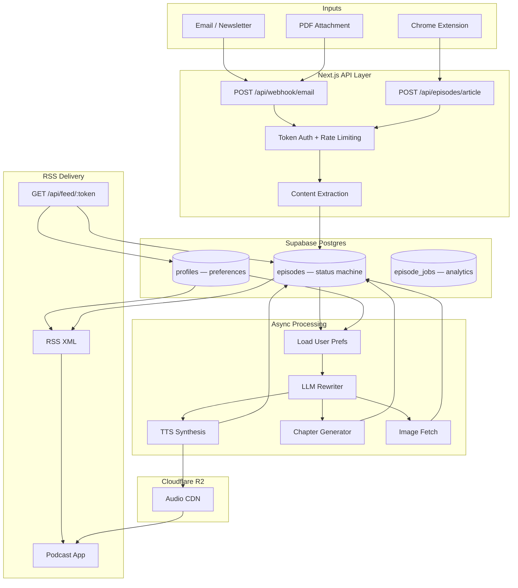

# PodBright

**Full-stack pipeline that converts emails, newsletters, PDFs, and web articles into personalized podcast episodes — delivered to any podcast app via private RSS.**

[podbright.ai](https://podbright.ai) · Core repo: private · Case study: public

---

## Traction

| Metric | Value |
|---|---|
| Registered users | 20 |
| Episodes generated | 185 |
| Weekly active users | 16 / 20 (80%) |
| Episodes per user (total) | 9.25 avg |
| Avg episodes / active user / week | 2 |
| 30-day retained users | 13 / 20 (65%) |

Early-stage, but the engagement ratios are what matter: 80% WAU and 65% 30-day retention on a product with no notifications, no social loop, and no re-engagement email. Users come back because the habit — forward newsletter, hear it on the commute — works. 185 episodes from 20 users means the pipeline is running, not just being demoed.

---

## Problem

Knowledge workers subscribe to 10–20 newsletters. They read fewer than half. The content isn't the problem — the format is. Newsletters are written for screens, consumed in fragments, and compete with email inbox zero. They don't fit the 40 minutes of commute or exercise time that is audio-compatible but not screen-compatible.

Existing options: save-for-later apps (Pocket, Instapaper) that become graveyards, generic TTS apps that sound like a robot reading a webpage, or nothing.

The gap is personal, high-volume text content with no audio equivalent.

---

## Solution

PodBright is a three-step transformation: **ingest → rewrite → synthesize**, with delivery via the distribution channel users already have (their podcast app).

The critical insight is that TTS alone doesn't solve this. A newsletter read aloud verbatim is nearly unlistenable — bullet points become a list of dashes, link text ("click here") gets spoken aloud, email footers eat two minutes of dead audio. **The rewriting step is the product.** An LLM restructures the content for listening before a single byte of audio is generated: collapsing bullets into prose, removing visual artifacts, smoothing transitions, and optionally condensing to a target duration. The output sounds edited, not extracted.

**Inputs:** Email forward, PDF attachment, Chrome extension (web article)  
**Output:** Private RSS feed → any podcast app (Apple Podcasts, Overcast, Pocket Casts, AntennaPod)

User-configurable per account: voice (6 neural voices), mode (verbatim / summary), difficulty (simple / standard / technical), target duration (full / 3 / 5 / 10 min).

---

## Demo

> **Live:** [podbright.ai](https://podbright.ai)

| Dashboard | Settings | Episode |
|---|---|---|
| *(screenshot)* | *(screenshot)* | *(screenshot)* |

---

## Product Flow

```
1. Sign up
   ├── Assigned: private inbox address  (inbox+<token>@podbright.ai)
   └── Assigned: private RSS feed URL   (/api/feed/<feed_token>)
       └── User adds RSS feed once to their podcast app

2. Send content
   ├── Forward email / newsletter  →  inbound email webhook
   ├── Attach PDF to email         →  same webhook, PDF parser branch
   └── Chrome extension on article →  direct API call, scraped text

3. Ingestion (synchronous, <2s)
   ├── Validate sender token from To: address
   ├── Extract clean text (MIME parse → HTML strip → minimum length check)
   ├── Check rate limit (10/hr) and monthly cap
   ├── Insert episode record (status: queued)
   └── Return 200 — processing is fully async from here

4. Processing pipeline (async, 15–45s)
   ├── Load user preferences (voice, mode, difficulty, target_duration)
   ├── LLM rewrite for audio
   │   ├── Verbatim: clean, restructure, remove email chrome
   │   └── Summary:  condense to key points at target duration
   ├── TTS synthesis  ─────────────────────────┐
   ├── Chapter marker generation (parallel)    │ parallel
   ├── Unsplash cover image fetch (parallel) ──┘
   ├── Upload audio to Cloudflare R2
   └── Update episode: status → ready

5. Delivery
   └── Podcast app polls RSS feed → new episode appears automatically
       └── Audio streamed directly from Cloudflare R2 CDN
```

---

## Architecture



**Sequence diagram and full data model:** [`docs/architecture.md`](docs/architecture.md)

### Data stores

| Store | What lives here |
|---|---|
| Supabase Postgres | Episodes, profiles, queue state, analytics events |
| Cloudflare R2 | Audio files (5–25 MB each), served via CDN |
| Supabase Auth | User sessions, JWT |

---

## Technical Decisions

Full write-up with alternatives considered: [`docs/decisions.md`](docs/decisions.md)

### 1. LLM rewrite as a first-class pipeline step — not optional cleanup

Early version: pipe raw email text directly to TTS. Result: unlistenable. Bullet points became "dash item dash item", link text was read aloud, email footers consumed two minutes. Users described it as "a robot reading a webpage."

The fix was to treat the LLM rewrite as the core transformation, not preprocessing noise reduction. The rewriter:
- Converts bullet lists to spoken sequences
- Removes visually-meaningful but aurally-noisy content (link text, image captions, "click here")
- Restructures sentences for speech rhythm (shorter clauses, fewer subordinate phrases)
- Strips email chrome (headers, footers, unsubscribe notices, tracking pixel artifacts)
- In summary mode: extracts key points at a target duration, not just truncates

Cost: ~2–4¢ per episode in LLM tokens. Worth it — the quality delta is immediately perceptible.

Post-processing audio was considered and rejected: TTS errors from bad input can't be fixed without re-generating the entire file.

### 2. TTS provider: Unreal Speech over OpenAI TTS

| Provider | Cost / 1M chars | Max input | Chunking needed |
|---|---|---|---|
| ElevenLabs | ~$30–60 | 5,000 chars | Yes |
| OpenAI TTS | ~$15 | 4,096 tokens | Yes |
| Unreal Speech | ~$1–2 | Unlimited | No |
| Google Cloud | ~$4–16 | 5,000 bytes | Yes |

OpenAI TTS was ruled out not on quality but on economics and chunking. A 10,000-word newsletter is ~50,000 characters. OpenAI's 4,096-token limit requires splitting the text, synthesizing 5–8 chunks, then stitching the audio — introducing audible seam artifacts and 3–5x the API calls. Unreal Speech accepts the full document in one call and costs ~10x less per character.

ElevenLabs produces the best output but at a price that requires a premium pricing tier the product wasn't ready to charge for at launch.

Provider abstracted behind a single function — swapping requires one file change.

### 3. RSS feed: token-in-URL, not authenticated

Podcast apps don't support OAuth. Apple Podcasts silently drops feeds that require HTTP Basic Auth. The only access control mechanism compatible with all podcast apps is a secret embedded in the URL path itself.

Tradeoff: anyone with the URL can access the feed. Mitigated by: 32-character random token (guessing is infeasible), UI warning against sharing, token regeneration available.

The alternative — building a proprietary player — was rejected outright. The product's core value is working with apps users already have.

### 4. Postgres as the job queue (with atomic claiming)

Chose not to introduce a dedicated queue service (SQS, BullMQ) at this stage. Postgres is sufficient, and adding a queue service adds a failure surface, deployment complexity, and credentials to manage.

Race condition protection for concurrent workers: the `queued → processing` transition uses a conditional update:

```sql
UPDATE episodes SET status = 'processing'
WHERE id = $1 AND status = 'queued'
RETURNING id;
```

Zero rows returned = episode already claimed. No external locking required. This is a single round-trip using Postgres's native row-level semantics.

Migration threshold: ~100 concurrent workers processing simultaneously. At current scale, nowhere near that.

### 5. Cloudflare R2 over S3

Egress fees. Audio files are 5–25 MB each. Podcast apps fetch them on every play and don't reliably cache between sessions. At scale, S3 egress becomes the largest infrastructure line item. R2 has zero egress fees and an S3-compatible API — zero code changes required.

### 6. Fire-and-forget analytics

All analytics writes are wrapped in `try/catch`, never awaited on the critical path. A missed event slightly degrades reporting. A failed episode creation because an analytics insert timed out destroys user trust. The asymmetry is obvious — analytics are never on the hot path.

Usage caps (monthly episode limit) are checked synchronously before processing — they are not analytics, they are billing constraints.

---

## System Constraints

Operating numbers from production:

| Constraint | Value | Notes |
|---|---|---|
| Webhook response time | <2s | Processing is fully async |
| End-to-end processing | 15–45s | Scales with content length |
| Cost per episode | ~$0.03–0.08 | LLM rewrite + TTS; summary mode ~60% cheaper |
| Max content size | 120,000 chars | ~90 min read; enforced at ingestion |
| Monthly episode cap (free) | 10 | Checked synchronously pre-processing |
| Rate limit | 10 episodes/hour | Per-user, prevents abuse |
| Audio file size | 5–25 MB | Varies with duration and voice |

---

## Failure Handling

### Input failures (reject fast, explain clearly)

| Failure | Detection point | Behaviour |
|---|---|---|
| Content too short (<50 chars) | Ingestion | 400, user informed |
| Encrypted PDF | Pre-processing | Episode marked failed, error_type: encrypted_pdf |
| HTML-only with no extractable text | Parser | Fallback chain → reject with specific error |
| Content over 120k chars | Ingestion | 413, user informed |
| Duplicate forward (Gmail sends twice) | — | Creates duplicate episode; user deletes via dashboard |

### Processing failures (structured, recoverable)

All processing failures write to `episode_jobs` with a classified `error_type`:

```
timeout | no_text | r2_upload | char_limit | encrypted_pdf | other
```

This enables per-type failure rate tracking in the admin analytics dashboard, which shows whether failures cluster around a specific input type (e.g., a spike in `encrypted_pdf` errors after users discover PDF support).

Episode stays in `failed` state; user can delete and resubmit. No silent failures.

### Idempotency

Processing claim is atomic — double-processing the same episode is impossible by construction (see decision #4). Ingestion is not idempotent (duplicate forwards create duplicate records), but this is a known edge case handled at the UI layer.

---

## What Breaks at 10x Scale

### Bottlenecks

| Component | Current approach | Breaks at | Signal |
|---|---|---|---|
| Processing | Async inside Next.js process | ~20 concurrent | Response time degrades |
| Queue | Postgres status column | ~100 concurrent workers | Lock contention |
| RSS feed | DB query per request | ~1,000 req/min | Query latency |
| TTS | Single provider account | Provider rate limit | 429s from TTS API |
| LLM rewrite | Single provider | Provider rate limit | Timeouts, queue backup |

### Cost explosion points

TTS cost scales linearly with character count, not user count. A power user forwarding 20 long newsletters/week costs ~10x more to serve than an average user. Without per-user cost visibility, margin disappears silently.

The `episode_jobs` table tracks character count, processing time, and audio size per episode per user — giving exact per-user cost attribution without external tooling.

### Redesign for 10x

```
Now:
  Webhook → createEpisode() → processEpisode() [async in web process]

10x:
  Webhook → createEpisode() → enqueue(episodeId) [returns immediately]
                                     ↓
                          Worker fleet (autoscales on queue depth)
                                     ↓
                    ┌────────────────┴────────────────┐
               LLM rewrite                      Image fetch
                    └────────────────┬────────────────┘
                               TTS synthesis
                                     ↓
                          R2 upload → DB update → feed cache invalidation
```

Key additions:
- **Worker autoscaling on queue depth** — not request rate, which lags
- **RSS feed caching** — Redis, TTL 60s, invalidated per user on new episode; eliminates per-request DB query
- **Provider fallback** — if primary TTS rate-limits, retry on secondary; never expose provider failure to users
- **Per-user cost alerts** — flag accounts at 3x average cost/week before they become margin problems

---

## Challenges and Tradeoffs

### Email variability is the hardest engineering problem

TTS quality is predictable. Email content is not. HTML newsletters use undocumented layout conventions: div-as-paragraph, inline styles as formatting signals, nested tables, base64-encoded content, and comment blocks used as whitespace. The parser must handle all of it and still produce clean prose.

The layered extraction strategy: try plain-text part → fall back to HTML strip → validate minimum length → reject with specific error. Each layer's failure produces a structured error type, not a generic "failed to parse."

The unsolved edge case: newsletters that are 80% image content with minimal alt text. The parser finds the text successfully but the episode is mostly dead audio. Detection heuristic (text-to-HTML ratio below threshold) is on the roadmap.

### Processing latency vs perceived latency

The actual latency (15–45s) is acceptable for async delivery to a podcast app — apps poll every 15–30 minutes anyway, so the 30s processing time is irrelevant in normal usage. The perceived latency problem is the user who forwards an email and immediately opens their podcast app expecting the episode to be there.

Mitigation: episode appears as "Queued" in the dashboard within 2 seconds of the webhook firing. Users see that the system has received their content. The expectation gap is between the dashboard (which is real-time) and the podcast app (which polls on its own schedule) — this is a known UX friction point.

### Cost vs quality vs latency triangle

Cheap TTS (Unreal Speech) → good enough quality, low cost, acceptable latency  
Best TTS (ElevenLabs) → noticeably better quality, 20–30x cost, similar latency  
LLM rewrite model → quality is highly sensitive to model choice; switching to a weaker model saves 40% but produces noticeably worse audio restructuring

Current tradeoff: best affordable TTS + best LLM rewrite. Quality is good enough that users don't notice the TTS ceiling; they notice the rewriting quality immediately.

---

## Roadmap

**Near term**
- Per-episode settings override (current preferences are account-wide)
- Email digest mode: batch same-day inputs into one episode
- Deduplication: detect re-forwarded content by hash before processing

**Distribution**
- Zapier / Make connector for non-Gmail setups
- Slack and Notion as input sources
- Shareable public episodes (opt-in)

**Infrastructure**
- Decouple processing into a dedicated worker service
- BullMQ queue with dead-letter lanes and per-type retry policies
- Redis cache layer for RSS feed generation

**Product intelligence**
- Listening completion analytics (requires player, not just RSS)
- Per-user cost tracking dashboard
- Content-aware pipeline routing (auto-select difficulty and duration based on content type)

---

## How This Evolves into an AI Platform

Full write-up: [`docs/extending-to-ai-platform.md`](docs/extending-to-ai-platform.md)

The current architecture is a fixed linear pipeline. The natural evolution is making the pipeline configurable by content type:

```
Input arrives
    ↓
Router agent (lightweight classifier)
    ├── Technical paper    → Technical difficulty, full length, chapter markers
    ├── News briefing      → 3min summary, Standard difficulty
    ├── Long-form essay    → Standard difficulty, 10min, chapters
    └── Product changelog  → skip (user-defined filter)
```

The second extension is multi-modal output from a single processing run. The LLM rewrite step currently produces audio-optimized text. The same step branches to: audio (current), summary card, highlights export, structured notes. One newsletter → one processing cost → multiple output formats.

The foundation is already in place: structured content schema, processing queue, analytics instrumentation, modular rewriting step. The extension is architectural (DAG over linear pipeline) and product (deciding which output formats to prioritize).

---

## Stack

| Layer | Technology | Decision rationale |
|---|---|---|
| Frontend + API | Next.js App Router | One deployment; RSC for dashboard; API routes for all webhooks |
| Database + Auth | Supabase | Postgres + Auth + RLS in one managed service; no separate auth infrastructure |
| Audio storage | Cloudflare R2 | Zero egress fees; S3-compatible API; no code changes from S3 |
| TTS | Unreal Speech | ~10x cheaper than OpenAI TTS; no chunking for long-form; multiple neural voices |
| LLM rewriting | OpenAI / Claude | Prompt-swappable; model selected on cost/quality per task |
| Email ingestion | Inbound webhook | Decoupled from MX records; works with any email client's forwarding |
| Mobile | React Native (Expo) | Shared TypeScript types with web; one codebase for iOS + Android |

---

## Why This Problem

Most AI products are demos: a model call wrapped in a UI. This project is a pipeline: content arrives in uncontrolled formats from untrusted sources, must be transformed across mediums, and delivered reliably to third-party clients that don't support re-delivery.

The interesting problems are not the model calls. They are email parsing reliability at the tail of the distribution, audio latency UX under async constraints, cost scaling that is linear with usage not users, and RSS compatibility across 20+ podcast clients with no common error reporting mechanism.

Building and operating this at production teaches what AI system design actually requires: the model is one component, the plumbing is the product.

---

*Case study repository. Core codebase is private. Code samples are illustrative and sanitized.*
