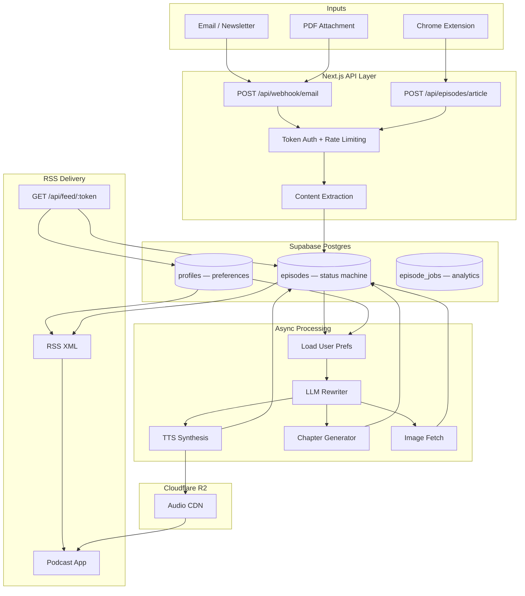

# PodBright

**Full-stack pipeline that converts emails, newsletters, PDFs, and web articles into personalized podcast episodes — delivered to any podcast app via private RSS.**

[podbright.ai](https://podbright.ai) · Core repo: private · Case study: public

---

## Traction

| Metric | Value |
|---|---|
| Registered users | 20 |
| Episodes generated | 185 |
| Weekly active users | 16 / 20 (80%) |
| Episodes per user (total) | 9.25 avg |
| Avg episodes / active user / week | 2 |
| 30-day retained users | 13 / 20 (65%) |

Early-stage, but the engagement ratios are what matter: 80% WAU and 65% 30-day retention on a product with no notifications, no social loop, and no re-engagement email. Users come back because the habit — forward newsletter, hear it on the commute — works. 185 episodes from 20 users means the pipeline is running, not just being demoed.

---

## Problem

Knowledge workers subscribe to 10–20 newsletters. They read fewer than half. The content isn't the problem — the format is. Newsletters are written for screens, consumed in fragments, and compete with email inbox zero. They don't fit the 40 minutes of commute or exercise time that is audio-compatible but not screen-compatible.

Existing options: save-for-later apps (Pocket, Instapaper) that become graveyards, generic TTS apps that sound like a robot reading a webpage, or nothing.

The gap is personal, high-volume text content with no audio equivalent.

---

## Solution

PodBright is a three-step transformation: **ingest → rewrite → synthesize**, with delivery via the distribution channel users already have (their podcast app).

The critical insight is that TTS alone doesn't solve this. A newsletter read aloud verbatim is nearly unlistenable — bullet points become a list of dashes, link text ("click here") gets spoken aloud, email footers eat two minutes of dead audio. **The rewriting step is the product.** An LLM restructures the content for listening before a single byte of audio is generated: collapsing bullets into prose, removing visual artifacts, smoothing transitions, and optionally condensing to a target duration. The output sounds edited, not extracted.

**Inputs:** Email forward, PDF attachment, Chrome extension (web article)  
**Output:** Private RSS feed → any podcast app (Apple Podcasts, Overcast, Pocket Casts, AntennaPod)

User-configurable per account: voice (6 neural voices), mode (verbatim / summary), difficulty (simple / standard / technical), target duration (full / 3 / 5 / 10 min).

---

## Demo

> **Live:** [podbright.ai](https://podbright.ai)

| Dashboard | Settings | Episode |
|---|---|---|
| *(screenshot)* | *(screenshot)* | *(screenshot)* |

---

## Product Flow

```
1. Sign up
   ├── Assigned: private inbox address  (inbox+<token>@podbright.ai)
   └── Assigned: private RSS feed URL   (/api/feed/<feed_token>)
       └── User adds RSS feed once to their podcast app

2. Send content
   ├── Forward email / newsletter  →  inbound email webhook
   ├── Attach PDF to email         →  same webhook, PDF parser branch
   └── Chrome extension on article →  direct API call, scraped text

3. Ingestion (synchronous, <2s)
   ├── Validate sender token from To: address
   ├── Extract clean text (MIME parse → HTML strip → minimum length check)
   ├── Check rate limit (10/hr) and monthly cap
   ├── Insert episode record (status: queued)
   └── Return 200 — processing is fully async from here

4. Processing pipeline (async, 15–45s)
   ├── Load user preferences (voice, mode, difficulty, target_duration)
   ├── LLM rewrite for audio
   │   ├── Verbatim: clean, restructure, remove email chrome
   │   └── Summary:  condense to key points at target duration
   ├── TTS synthesis  ─────────────────────────┐
   ├── Chapter marker generation (parallel)    │ parallel
   ├── Unsplash cover image fetch (parallel) ──┘
   ├── Upload audio to Cloudflare R2
   └── Update episode: status → ready

5. Delivery
   └── Podcast app polls RSS feed → new episode appears automatically
       └── Audio streamed directly from Cloudflare R2 CDN
```

---

## Architecture



**Sequence diagram and full data model:** [`docs/architecture.md`](docs/architecture.md)

### Data stores

| Store | What lives here |
|---|---|
| Supabase Postgres | Episodes, profiles, queue state, analytics events |
| Cloudflare R2 | Audio files (5–25 MB each), served via CDN |
| Supabase Auth | User sessions, JWT |

---

## System Metrics

Operating numbers from production. Latency and cost figures are real; throughput capacity is estimated from provider limits.

| Metric | Value | Notes |
|---|---|---|
| Webhook response time | <2s | Processing fully async; webhook never blocks |
| End-to-end processing | 15–45s | LLM rewrite dominates; scales with content length |
| LLM rewrite cost | ~$0.02–0.05 / episode | Input + output tokens; summary mode ~50% cheaper |
| TTS cost | ~$0.003–0.04 / episode | Scales with character count after rewrite |
| Total cost per episode | ~$0.03–0.08 | Avg ~$0.05; long verbatim PDFs hit $0.12–0.15 |
| Audio file size | 5–25 MB | Varies with duration and voice |
| Max content size | 120,000 chars | ~90-min read equivalent; enforced at ingestion |
| Estimated throughput | ~40–60 jobs/hr | Bounded by TTS provider rate limits |

---

## Unit Economics

| Scenario | Monthly cost to serve | Monthly revenue | Gross margin |
|---|---|---|---|
| Free user (5 eps/mo) | ~$0.25 | $0 | — |
| Paid user, 30 eps/mo @ $6 | ~$1.50 | $6 | ~75% |
| Paid user, 60 eps/mo @ $6 | ~$3.00 | $6 | ~50% |
| Power user, 120 eps/mo @ $6 | ~$6.00 | $6 | ~0% |

**The structural risk:** TTS cost scales with character count, not episode count. A power user forwarding long PDFs can cost 3–4x more per episode than a casual user forwarding short newsletters — but they pay the same subscription price. Without per-user cost tracking, margin erodes silently as power users self-select into the paid tier.

**The mitigation built in:** The `episode_jobs` table tracks character count and audio size per episode per user, enabling exact per-user COGS attribution. An episode cap on paid tiers and a content length cap (120k chars) bound the worst-case outlier cost.

**Planned pricing:** $6/month for 40 episodes/month. At the average $0.05/episode, this yields ~67% gross margin. Unlimited pricing is not viable at the current per-character TTS cost structure.

---

## Technical Decisions

Full write-up with alternatives considered: [`docs/decisions.md`](docs/decisions.md)

### 1. LLM rewrite as a first-class pipeline step — not optional cleanup

Early version: pipe raw email text directly to TTS. Result: unlistenable. Bullet points became "dash item dash item", link text was read aloud, email footers consumed two minutes. Users described it as "a robot reading a webpage."

The fix was to treat the LLM rewrite as the core transformation, not preprocessing. The rewriter converts bullets to spoken sequences, removes visually-meaningful but aurally-noisy content ("click here", image captions), restructures sentence rhythm for listening, and strips email chrome. In summary mode: extracts key points at a target duration rather than truncating.

Cost: ~2–4¢ per episode in LLM tokens. The quality delta is immediately perceptible — this is the line that separates the product from a TTS wrapper.

Post-processing audio was considered and rejected: TTS errors caused by bad input text can't be corrected without re-generating the entire file.

### 2. TTS provider: Unreal Speech over OpenAI TTS

| Provider | Cost / 1M chars | Max input | Chunking needed |
|---|---|---|---|
| ElevenLabs | ~$30–60 | 5,000 chars | Yes |
| OpenAI TTS | ~$15 | 4,096 tokens | Yes |
| Unreal Speech | ~$1–2 | Unlimited | No |
| Google Cloud | ~$4–16 | 5,000 bytes | Yes |

OpenAI TTS was ruled out not on quality but on two compounding problems. First, economics: at ~$15/1M chars vs Unreal Speech's ~$1–2/1M, the per-episode cost is ~10x higher. Second, input limits: a 10,000-word newsletter is ~50,000 characters. OpenAI's 4,096-token limit requires splitting into 5–8 chunks, synthesizing each, then stitching — introducing audible seam artifacts and multiplying API calls. Unreal Speech accepts the full document in one call.

ElevenLabs produces measurably better output but at a price requiring a premium tier the product wasn't ready to charge at launch. Abstracted behind a single function; provider swap is a one-file change.

### 3. RSS feed: token-in-URL, not authenticated

Podcast apps don't support OAuth. Apple Podcasts silently drops feeds requiring HTTP Basic Auth. Every podcast app supports private RSS feeds with a secret embedded in the URL — this is the only access control mechanism with universal compatibility.

Tradeoff accepted: anyone with the URL can access the feed. Mitigated by a 32-character random token (brute-force infeasible), UI warning against sharing, and token regeneration. The alternative — a proprietary player — was rejected. Working with apps users already have is the product's distribution advantage; a custom player eliminates it.

### 4. Postgres as the job queue (with atomic claiming)

Chose not to introduce SQS or BullMQ at this stage. A dedicated queue adds a failure surface, deployment complexity, and credentials. Postgres is sufficient, and the queue pattern is implemented cleanly.

Race condition protection: the `queued → processing` transition is a conditional update:

```sql
UPDATE episodes SET status = 'processing'
WHERE id = $1 AND status = 'queued'
RETURNING id;
```

Zero rows returned = already claimed. Single round-trip, no external coordination, uses Postgres row-level locking. Migration threshold is ~100 concurrent workers — currently nowhere near it. This is the right call at current scale; it becomes the wrong call at 10x.

### 5. Cloudflare R2 over S3

Audio files are 5–25 MB each. Podcast apps fetch them on every play and don't reliably cache across sessions. S3 charges ~$0.09/GB egress. R2 charges $0. With even 500 users playing 10 episodes/month, S3 egress alone would exceed R2's total cost. R2's S3-compatible API required zero code changes.

### 6. Fire-and-forget analytics

All analytics writes are wrapped in `try/catch`, never awaited on the critical path. A missed analytics event degrades reporting marginally. A failed episode creation because an analytics insert timed out destroys user trust. The asymmetry makes the tradeoff obvious.

Usage cap checks (monthly episode limit) are synchronous and blocking — they are billing constraints, not analytics.

---

## Failure Handling

### Input failures — reject fast, explain specifically

| Failure | Detection | Behaviour |
|---|---|---|
| Content too short (<50 chars) | Ingestion | 400, user informed |
| Encrypted PDF | Pre-processing | Episode failed, `error_type: encrypted_pdf` |
| HTML-only, no extractable text | Parser fallback chain | Structured error, user informed |
| Content over 120k chars | Ingestion | 413, user informed |
| Duplicate forward (Gmail double-send) | — | Duplicate episode created; user deletes via dashboard |

### Processing failures — structured, classified, surfaced

All failures write to `episode_jobs` with a classified `error_type`:

```
timeout | no_text | r2_upload | char_limit | encrypted_pdf | other
```

Classification is intentional — it enables failure rate tracking by type in the analytics dashboard. A spike in `encrypted_pdf` after PDF support ships, or `timeout` during an LLM outage, is immediately visible without log-diving. Episode stays in `failed` state with the message surfaced in the dashboard. No silent failures.

### Idempotency

Processing claim is atomic — double-processing is impossible by construction (see decision #4). Ingestion is not idempotent; duplicate forwards create duplicate records. Known edge case; addressed at the UI layer (episode list shows title, user can identify and delete duplicates).

---

## What Breaks at 10x Scale

| Component | Current approach | Breaks at | Symptom |
|---|---|---|---|
| Processing | Async inside Next.js process | ~20 concurrent | Response time degrades |
| Queue | Postgres status column | ~100 concurrent workers | Lock contention |
| RSS feed | DB query per request | ~1,000 req/min | Query latency |
| TTS | Single provider account | Provider rate limit | 429s, queue backup |
| LLM rewrite | Single provider | Provider rate limit | Timeouts, stalled jobs |

**Cost explosion:** TTS cost is the dominant variable. At 10x users with average usage, monthly TTS spend scales linearly. The risk isn't average users — it's the power user tail. Ten users each generating 100 long-form episodes/month cost as much as 200 average users. Per-user cost attribution (built into `episode_jobs`) surfaces this before it becomes a margin problem, but the structural fix is episode caps on paid tiers.

### Redesign for 10x

```
Now:
  Webhook → createEpisode() → processEpisode() [async in web process]

10x:
  Webhook → createEpisode() → enqueue(episodeId) [returns immediately]
                                     ↓
                          Worker fleet (autoscales on queue depth)
                                     ↓
                    ┌────────────────┴────────────────┐
               LLM rewrite                      Image fetch
                    └────────────────┬────────────────┘
                               TTS synthesis
                                     ↓
                          R2 upload → DB update → feed cache invalidation
```

- **Worker autoscaling on queue depth** — not request rate, which lags by design
- **RSS feed caching** — Redis, TTL 60s, invalidated per-user on new episode; eliminates per-request DB query
- **Provider fallback** — TTS and LLM each fail over to a secondary provider; provider failure becomes invisible to users
- **Model tiering** — short content (<3,000 chars) doesn't need the full LLM rewrite; a lighter model at 30% of the cost produces equivalent output

---

## Challenges and Tradeoffs

### Email variability is the hardest reliability problem

TTS quality is predictable. Email input is not. HTML newsletters use undocumented conventions: div-as-paragraph, nested tables as layout, base64-encoded content, comment blocks as whitespace, and inline styles as the only semantic signal. The parser must handle all of it and produce clean prose.

Layered extraction: try plain-text MIME part → fall back to HTML strip → validate minimum length → reject with structured error. Every failure produces a classified error type, not a generic "parse failed."

Unsolved edge case: newsletters that are 80% image with minimal alt text. The parser succeeds — it finds the text — but the episode is thin. Detection heuristic (text-to-HTML length ratio below threshold) is on the roadmap.

### Async latency vs perceived latency

Actual processing time (15–45s) is irrelevant to delivery — podcast apps poll every 15–30 minutes, so the episode is ready long before the app checks. The perceived latency problem is the user who forwards an email and immediately checks their podcast app expecting it to be there.

Mitigation: episode appears as "Queued" in the dashboard within 2 seconds of the webhook. The user sees the system has received their content. The gap between dashboard (real-time status) and podcast app (polling schedule) remains an open UX problem — one that requires push notification support or a native player to fully close.

### RSS delivery is both the product's advantage and its blind spot

Delivering via RSS means zero install friction and compatibility with every podcast app on day one. It also means zero listening analytics. There's no signal on whether users finish episodes, which voices correlate with higher completion rates, or whether summary mode produces better retention than verbatim. Every product decision about audio quality is made without feedback from the distribution channel.

This is a known architectural tradeoff. Fixing it requires either a custom player (adds friction, loses compatibility) or a proxy audio server that logs play events before forwarding to R2 (preserves RSS compatibility, adds infrastructure).

---

## What I Would Do Differently

**Separate processing from the web process on day one.** Running async processing inside the Next.js process works at low volume but creates a coupled system that's painful to scale independently. The right architecture from the start is a thin API that enqueues jobs and a separate worker that processes them. Retrofitting this later requires changing the deployment topology, not just the code.

**Version-control the LLM rewrite prompt from the beginning.** Prompt changes affect all future episodes and are currently deployed as code changes. There's no way to A/B test prompt variants, roll back a prompt that degraded output quality, or attribute quality regressions to specific prompt changes without reading git history. A prompt versioning system (even a simple DB table with prompt versions and activation dates) would have made quality iteration significantly faster.

**Build input deduplication at ingestion, not as a UI afterthought.** Gmail occasionally delivers the same email twice. The current fix is "user deletes the duplicate from their dashboard." The right fix is a content hash at ingestion that rejects or deduplicates submissions with identical content within a 60-second window. This was a known edge case that was deferred; it should have been handled at the data model level from day one.

**Instrument listening completion before shipping.** The product has no signal on whether users finish episodes. This is the most important quality metric and it was made structurally unavailable by the RSS-only delivery choice. A proxy audio server that logs completion events should have been considered in the initial architecture, not as a later addition.

---

## Key Insight

**Delivering via RSS is the product's best distribution decision and its worst analytics decision — and these are the same decision.**

RSS compatibility means the product works with every podcast app on day one, no installation required, no proprietary player to build or maintain. This is why the habit forms: users add the feed once, then it just works, forever, in the app they already use every day. The zero-friction distribution is the reason engagement ratios are high.

But RSS provides no feedback channel. There's no play event, no completion signal, no skip data. Every decision about voice quality, summary length, and rewrite style is made without knowing what users actually listened to. The product optimizes for episode generation quality with no data on episode consumption quality.

Most AI product builders add RSS as an afterthought because "it's just a feed." The insight is that the delivery mechanism is a first-class architectural choice with consequences for analytics, pricing (per-episode vs per-minute), product iteration speed, and the long-term platform strategy. Choosing it intentionally — and understanding what you're giving up — is the difference between a design decision and an accident.

---

## Roadmap

**Near term**
- Per-episode settings override (preferences are currently account-wide)
- Input deduplication by content hash at ingestion
- Email digest mode: batch same-day inputs into one episode

**Distribution**
- Zapier / Make connector for non-Gmail setups
- Slack and Notion as input sources
- Shareable public episodes (opt-in) — the missing virality surface

**Infrastructure**
- Decouple processing into a dedicated worker service
- BullMQ queue with dead-letter lanes and per-type retry policies
- Redis cache layer for RSS feed generation
- Proxy audio server for listening completion analytics

**Product intelligence**
- Per-user cost tracking visible in admin dashboard
- Content-aware pipeline routing (auto-select difficulty and duration based on content type)
- LLM prompt versioning system

---

## How This Evolves into an AI Platform

Full write-up: [`docs/extending-to-ai-platform.md`](docs/extending-to-ai-platform.md)

The current architecture is a fixed linear pipeline. The natural evolution is a configurable pipeline where a routing layer selects processing parameters based on content type:

```
Input arrives
    ↓
Router (lightweight classifier)
    ├── Technical paper    → Technical difficulty, full length, chapter markers
    ├── News briefing      → 3min summary, Standard difficulty
    ├── Long-form essay    → Standard difficulty, 10min, chapters
    └── Product changelog  → skip (user-defined filter)
```

The second extension is multi-modal output from a single processing run. The rewrite step currently produces audio-optimized text. The same step branches to: audio (current), summary card, highlights export, structured notes — one newsletter, one LLM cost, multiple output formats.

The foundation is in place: structured content schema, processing queue, analytics instrumentation, modular rewriting step. The extension is architectural (DAG over linear pipeline) and product (which output formats to build first).

---

## Stack

| Layer | Technology | Why |
|---|---|---|
| Frontend + API | Next.js App Router | One deployment; RSC for dashboard; API routes for webhooks |
| Database + Auth | Supabase | Postgres + Auth + RLS in one service; no separate auth infrastructure |
| Audio storage | Cloudflare R2 | Zero egress fees; S3-compatible API; no code changes vs S3 |
| TTS | Unreal Speech | ~10x cheaper than OpenAI TTS; no chunking required for long-form |
| LLM rewriting | OpenAI / Claude | Prompt-swappable; model choice driven by cost/quality tradeoff per task |
| Email ingestion | Inbound webhook | Decoupled from MX; works with any email client's forwarding |
| Mobile | React Native (Expo) | Shared TypeScript types with web; iOS + Android from one codebase |

---

## Why This Problem

Most AI products are demos: a model call wrapped in a UI. This project is a pipeline: content arrives in uncontrolled formats from untrusted sources, must be transformed across mediums, and delivered reliably to third-party clients with no error reporting and no retry mechanism.

The interesting problems are not the model calls. They are email parsing reliability at the tail of the input distribution, latency UX under async constraints, cost scaling that is linear with usage not users, and RSS compatibility across 20+ podcast clients with no common spec for private feeds.

Building and operating this teaches what AI system design actually requires: the model is one component, the plumbing is the product.

---

*Case study repository. Core codebase is private. Code samples are illustrative and sanitized.*
