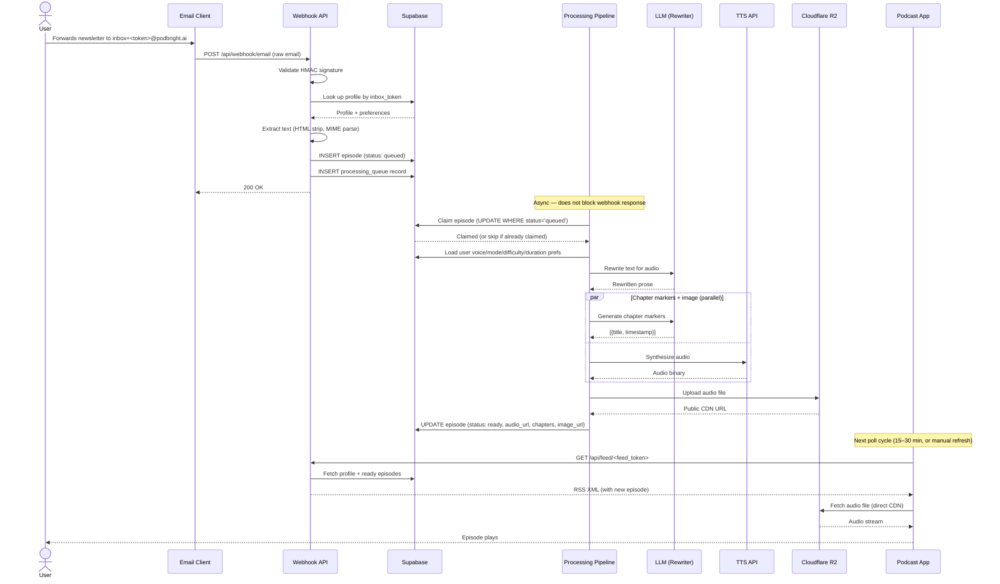
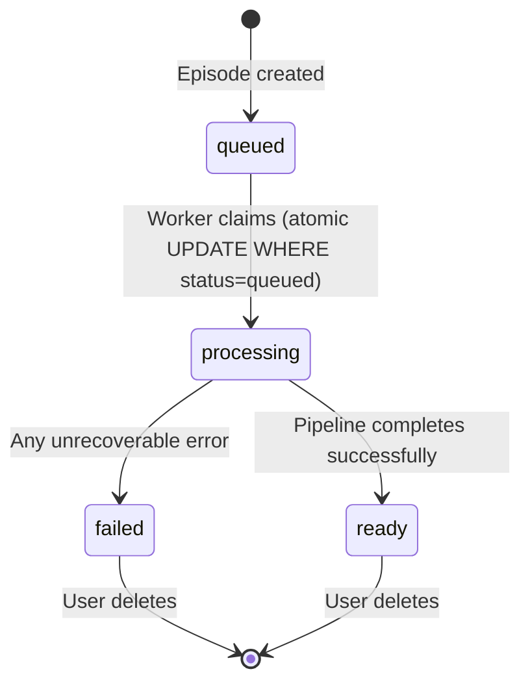

# Architecture

## System Architecture Diagram

```mermaid
graph TD
    subgraph Inputs
        A1[Email / Newsletter Forward]
        A2[PDF Attachment]
        A3[Chrome Extension]
    end

    subgraph Ingestion ["API Layer (Next.js)"]
        B1[/api/webhook/email]
        B2[/api/episodes/article]
        B3[Token Validation]
        B4[Content Extraction]
        B5[Rate Limit Check]
    end

    subgraph DB ["Supabase Postgres"]
        C1[(episodes)]
        C2[(profiles)]
        C3[(processing_queue)]
        C4[(analytics_events)]
    end

    subgraph Processing ["Async Processing Pipeline"]
        D1[Load User Preferences]
        D2[LLM Rewriter]
        D3[TTS Generator]
        D4[Chapter Marker Generator]
        D5[Unsplash Image Fetch]
    end

    subgraph Storage ["Cloudflare R2"]
        E1[Audio File Storage]
        E2[CDN Delivery]
    end

    subgraph Delivery ["Feed Delivery"]
        F1[/api/feed/:token]
        F2[RSS XML Generator]
        F3[Podcast App]
    end

    A1 --> B1
    A2 --> B1
    A3 --> B2

    B1 --> B3
    B2 --> B3
    B3 --> B4
    B4 --> B5
    B5 --> C1
    B5 --> C3

    C1 --> D1
    C2 --> D1
    D1 --> D2
    D2 --> D3
    D2 --> D4
    D2 --> D5
    D3 --> E1
    E1 --> E2
    D3 --> C1
    D4 --> C1
    D5 --> C1

    F1 --> C2
    C2 --> F2
    C1 --> F2
    F2 --> F3
    E2 --> F3
```

---

## Sequence Diagram: Email → Episode → Podcast App



---

## Data Model

### episodes

| Column | Type | Notes |
|---|---|---|
| id | uuid | PK |
| user_id | uuid | FK → profiles |
| title | text | From email subject or article title |
| description | text | Raw content (discarded post-processing) |
| audio_url | text | R2 CDN URL |
| duration_seconds | int | From TTS response |
| file_size_bytes | int | For storage tracking |
| status | text | queued / processing / ready / failed |
| error_message | text | Set on failure |
| chapters | jsonb | [{title, timestamp}] |
| image_url | text | Unsplash image URL |
| sender_name | text | Newsletter sender or article hostname |
| sender_email | text | Newsletter sender or user email (for web articles) |
| published_at | timestamptz | Feed publication time |
| created_at | timestamptz | |

### profiles

| Column | Type | Notes |
|---|---|---|
| id | uuid | FK → auth.users |
| email | text | |
| inbox_token | text | Used to route inbound email to user |
| feed_token | text | Used to authenticate RSS feed requests |
| extension_token | text | Used to authenticate Chrome extension |
| audio_mode | text | verbatim / summarized |
| target_duration | text | null / 3min / 5min / 10min |
| difficulty | text | simple / standard / technical |
| voice_id | text | Dan / Scarlett / Will / Liv / Amy / Glinda |

### episode_jobs (analytics)

| Column | Type | Notes |
|---|---|---|
| id | uuid | Same UUID as episodes.id |
| user_id | uuid | |
| source_type | text | email / pdf / chrome_plugin |
| character_count | int | Input text length |
| processing_time_ms | int | End-to-end pipeline duration |
| audio_size_bytes | int | |
| tts_provider | text | |
| ai_features_used | text[] | [tts, summarize, voice_select, chapters, ...] |
| status | text | queued / processing / completed / failed |
| error_message | text | |
| error_type | text | timeout / no_text / r2_upload / char_limit / encrypted_pdf |

---

## Episode Status Machine



**Race condition protection:** The `queued → processing` transition uses a conditional update:

```sql
UPDATE episodes
SET status = 'processing'
WHERE id = $1 AND status = 'queued'
RETURNING id;
```

If this returns 0 rows, the episode was already claimed by another worker. The current worker exits without processing. No locking required beyond Postgres row-level semantics.
